# 🎉 **User Management System** - MERN Stack Assignment  

[](https://fullstackintern.vercel.app/)  
[](https://github.com/Hailex798/FullStack-Intern)  

### **🌟 Overview**  
Welcome to the **User Management System**, a full-stack web application built using the **MERN Stack** (MongoDB, Express.js, React.js, Node.js).  

This project showcases:  
🔒 **Authentication** - Login/Signup functionality with secure JWT-based authentication.  
🎯 **Role-Based Access Control** - Specific user privileges for **Admins**, **Agents**, and **Users**.  
🚀 **Context API** - For managing user data efficiently in local browser storage.  

---
## **🌟 Assignment**  

The Assignment was provided in a Google Docs file, where the frontend Code was also provided.

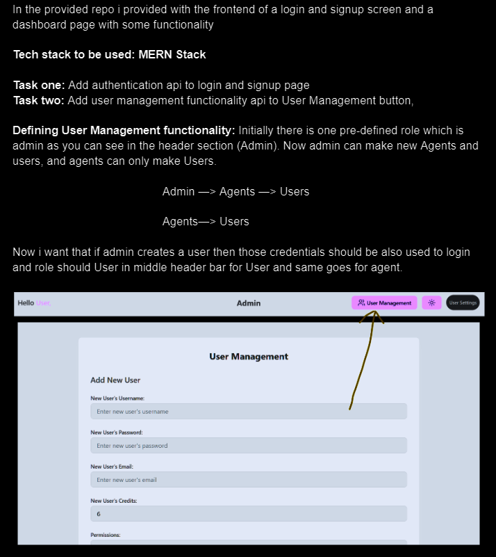

---

## ✨ **Features**  
### 🔑 **Authentication**  
- **Sign-up** 📝: Users can create accounts with their name, email, and password.  
  - Default role: **Admin**.  
  - No duplicate emails allowed!  
- **Login** ✅: Access your account securely with your credentials.  
  - User role is displayed in the header.  

### 🔒 **Role-Based Access Control**  
Depending on their role, users have access to different functionalities:  
- **👑 Admin**:  
  - Can create both **Agents** and **Users**.  
  - Full access to the **User Management** module.  

- **🛠️ Agent**:  
  - Can create **Users** only.  
  - Limited access to the **User Management** module.  

- **🙋‍♂️ User**:  
  - No access to User Management.  
  - Redirected to a "Restricted Access" page when attempting unauthorized actions.  

---

## 🎨 **Visual Overview**

Below are visual previews of the application’s various pages and features. Click on the dropdown arrows to view the corresponding screenshots.

*Visit the [Live Site](https://fullstackintern.vercel.app/) for a full experience!* 🌐

## Login Page
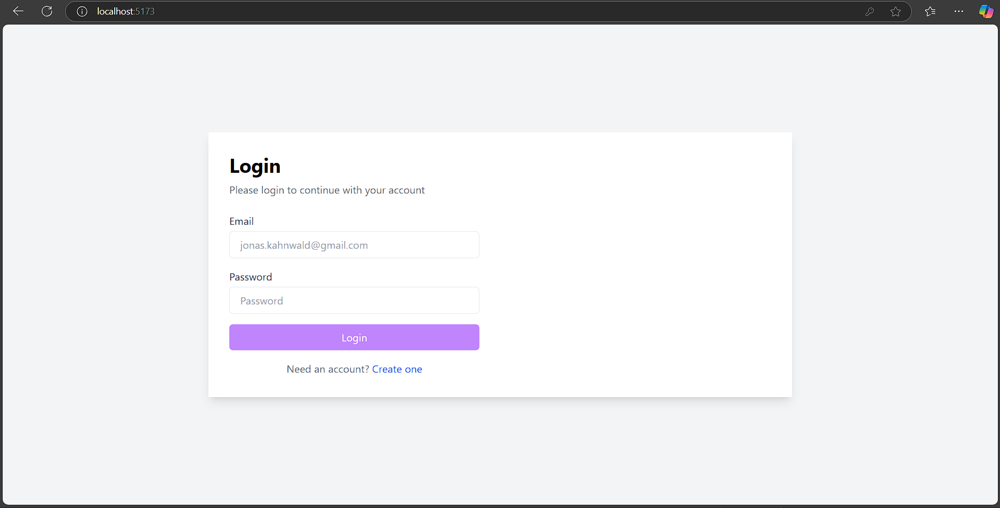
---
## Login Successful
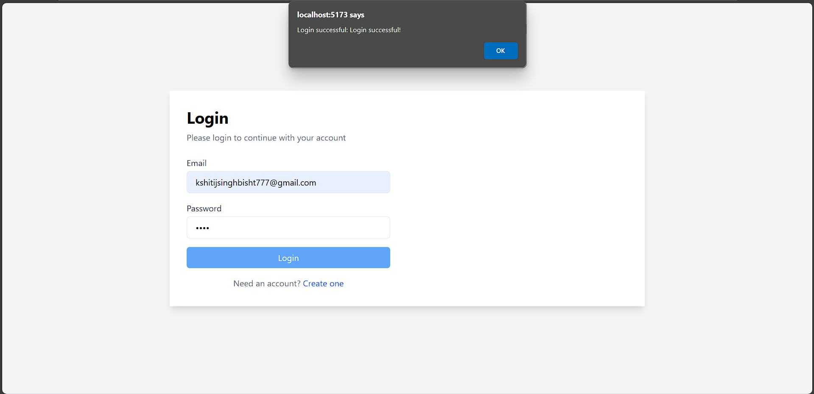
---
## MongoDB User Credentials Data
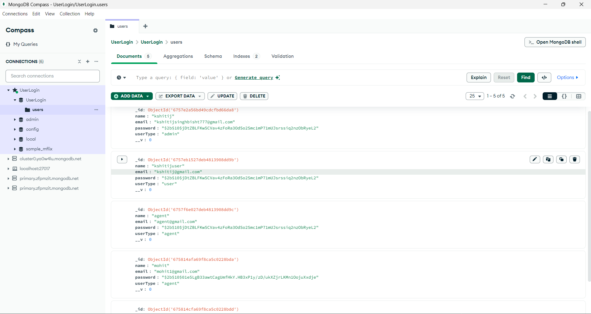

<details>
  <summary>🏠 <strong>Authentication</strong> (Click to Expand)</summary>

  - A SignUp Page for creating User Credentials.

  ## SignUp Page
  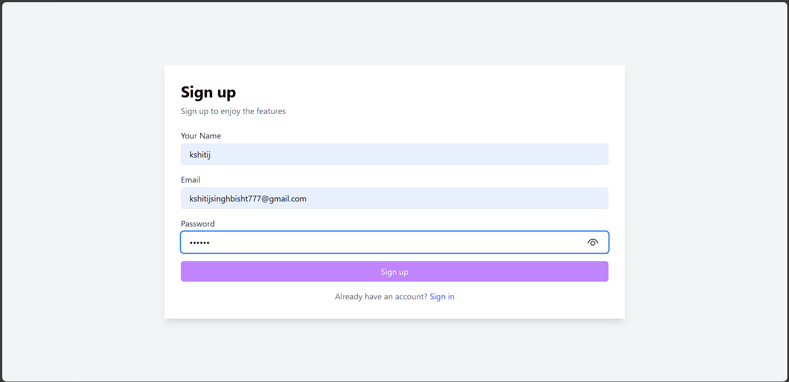
  ---
  ## SignUp Successful Page
  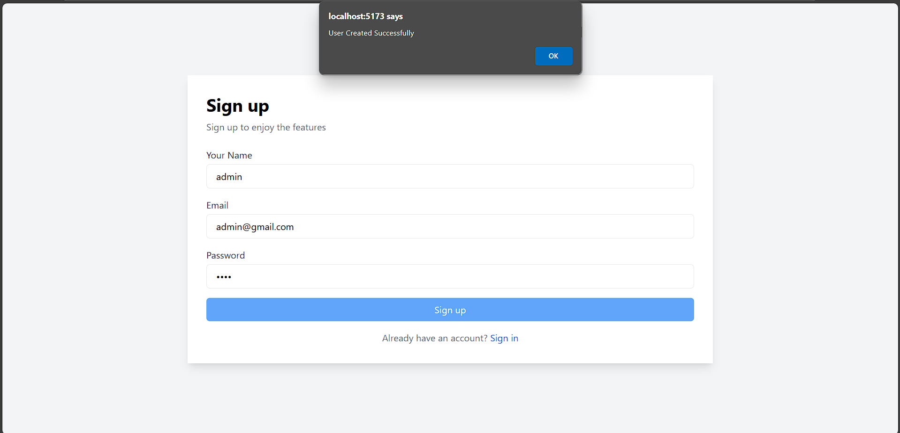

</details>

<details>
  <summary>👕 <strong>Admin</strong> (Click to Expand)</summary>

  - Admin LoggedIn Dashboard + User Management

  ## Admin Page User Management
  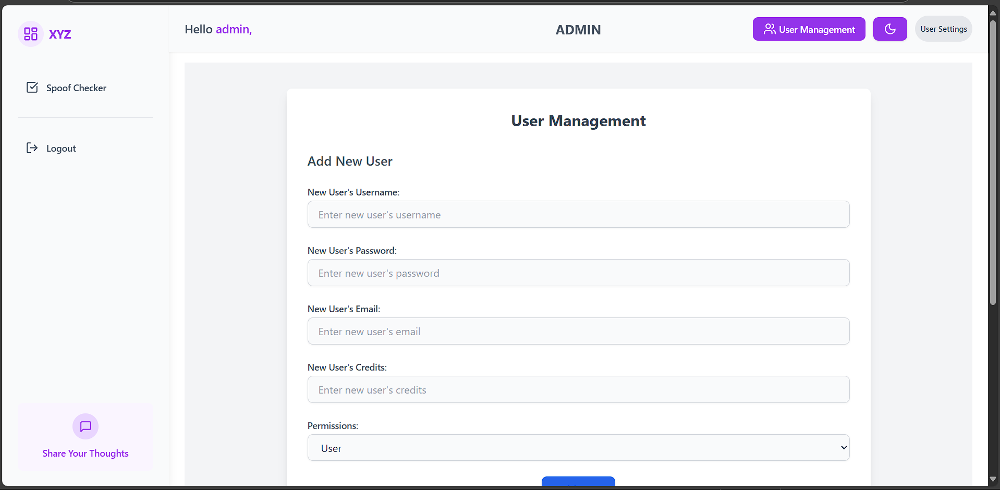
  ---
  ## Admin Page User Management Agent ID Creation
  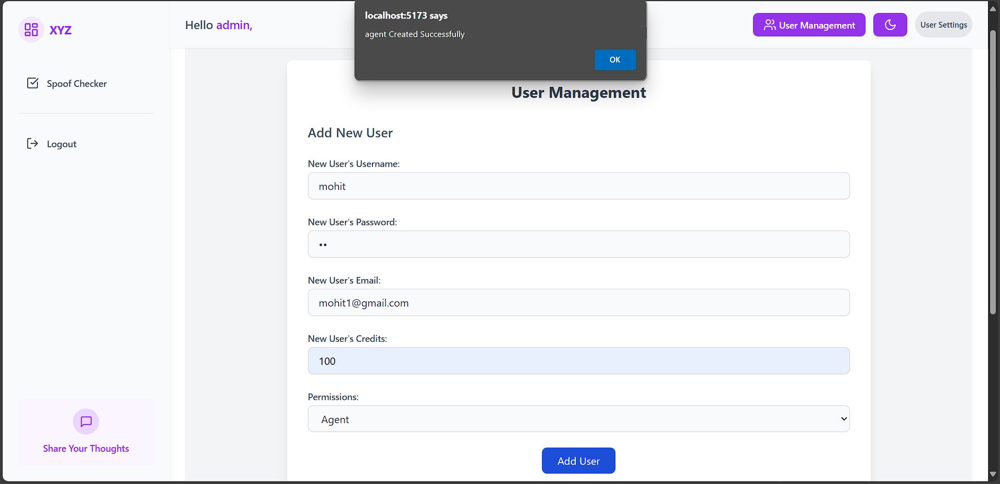
  ---
  ## Admin Page User Management User ID Creation
  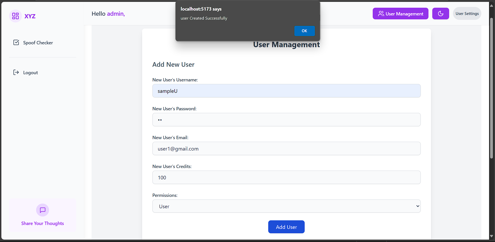

</details>

<details>
  <summary>👕 <strong>User</strong> (Click to Expand)</summary>

  - User LoggedIn Dashboard + User Management

  ## User Page
  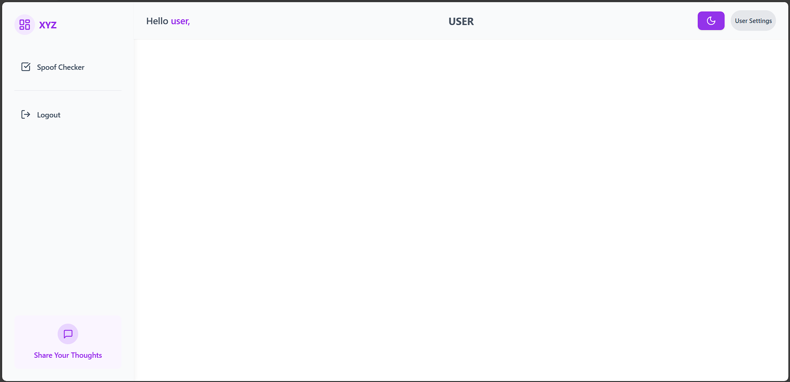
  ---
  ## User Page User Management
  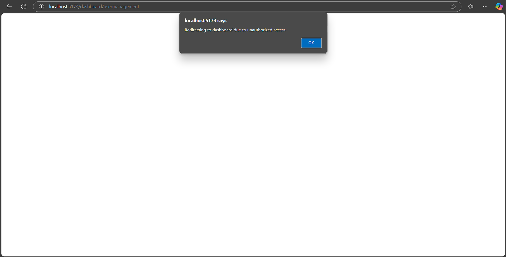
  ---
  ## User Page User Settings
  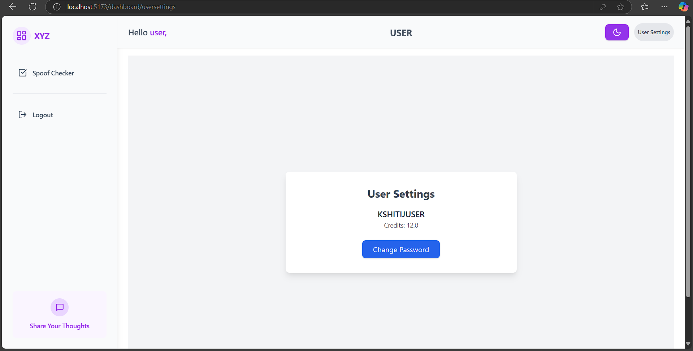

</details>

---

## 🏗️ **How It Works**  

### **Authentication Flow**  
1. **Sign-Up**:  
   - User enters name, email, and password.  
   - Data is sent to the backend and stored securely in MongoDB.  
2. **Login**:  
   - Credentials are validated, and a JWT is issued.  
   - The token is stored in the browser (Context API).  
3. **Protected Routes**:  
   - Based on the user's role, access is granted or restricted.  

---

## 🛠️ **Tech Stack**  

### **Frontend**  
- **React.js** ⚛️  
- **Tailwind CSS** 🎨  
- **React Router** 🌐 - For navigation and protected routing.  
- **Context API** 📦 - For storing user data securely in local browser storage.  

### **Backend**  
- **Node.js** 🌳  
- **Express.js** 🛤️  
- **MongoDB** 🍃 - For database management.  
- **JWT (JSON Web Tokens)** 🔐 - For authentication and role-based authorization.  
- **bcrypt.js** 🔑 - For password hashing.  

### **Build & Tools**  
- **Vite** ⚡ - Blazing fast build tool for frontend.  
- **Axios** 🌐 - For seamless API calls.  
- **dotenv** 🛡️ - For managing environment variables.  

---

## 🗂️ **Folder Structure**  
Organized for scalability and maintainability:  

### Project Structure
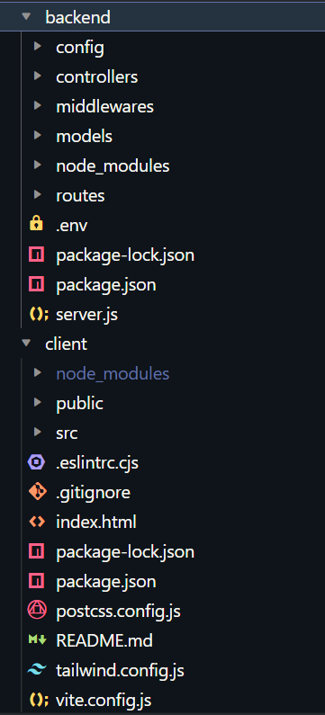

```
User-Management/
├── backend/
│   ├── config/       # Database connection setup
│   ├── controllers/  # Business logic for routes
│   ├── middlewares/  # JWT and role-based auth checks
│   ├── models/       # MongoDB schemas
│   ├── routes/       # API endpoints
│   └── server.js     # Entry point for the backend
├── client/
│   ├── public/       # Static assets
│   ├── src/
│   │   ├── components/   # Reusable UI components
│   │   ├── pages/        # Page-level components
│   │   ├── App.js        # Main app component
│   │   └── index.js      # React entry point
├── README.md
```

---

## 🚀 **Setup Instructions**  

1. **Clone the Repository** 📂  
   ```bash
   git clone https://github.com/your-repo-url.git
   cd User-Management
   ```

2. **Install Dependencies** 🛠️  
   - Backend:  
     ```bash
     cd backend
     npm install
     ```  
   - Frontend:  
     ```bash
     cd client
     npm install
     ```

3. **Configure Environment Variables** 🔐  
   - In the `backend` directory, create a `.env` file with:  
     ```
     MONGO_URI=<Your MongoDB Connection String>
     JWT_SECRET=<Your JWT Secret>
     ```

4. **Start the Servers** 🖥️  
   - Backend:  
     ```bash
     cd backend
     npm start
     ```  
   - Frontend:  
     ```bash
     cd client
     npm run dev
     ```  

5. **Access the Application** 🌐  
   Open `http://localhost:5173` in your browser.  

---

## 🔮 **Future Enhancements**  
- Add **Forgot Password** and **Reset Password** functionality.  
- Improve the UI for better user experience.  
- Add analytics for Admins to monitor system usage.  

---

## 👋 **Conclusion**  
This project is a testament to the power of the MERN stack, demonstrating how to integrate frontend and backend for seamless functionality. With role-based access, it offers a secure and scalable solution for user management.  

---

Let me know if you'd like any other tweaks! 🚀
